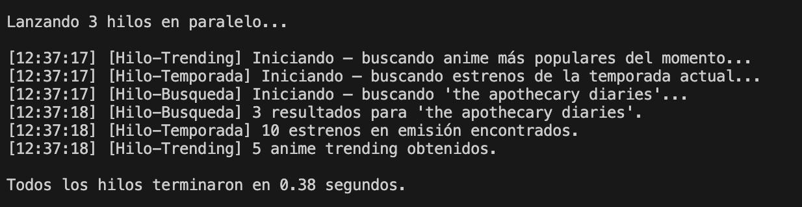
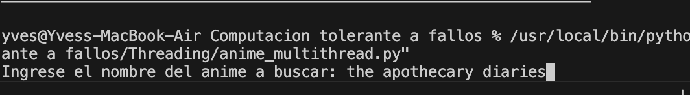
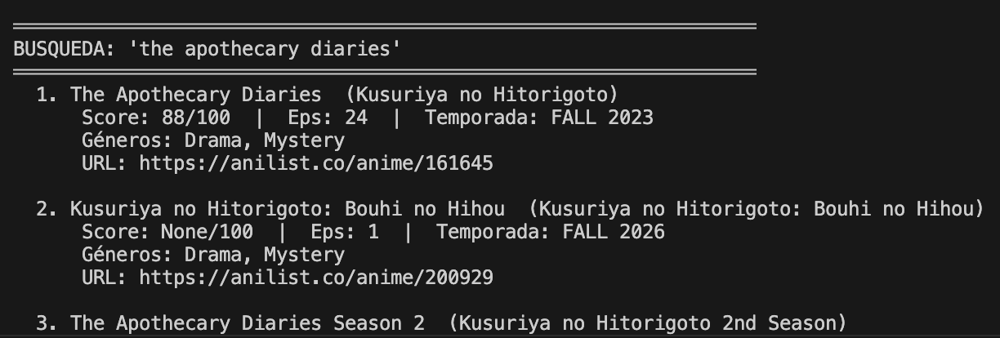

# Threading

El proyecto Permite realizar peticiones a la API de AniList en paralelo utilizando hilos. Esto permite obtener información sobre animes de forma más rápida y eficiente.

Para usarlo solo basta ejecutar el script, insertar el nombre del anime a buscar (no debe de ser exacto) y presionar enter. El resultado sera el anime buscado junto con los animes mas populares del momento y los estrenos de la temporada actual.

Y despues obtendremos lias para ver la informacion del anime y las tendencias que hay ahora mismo

